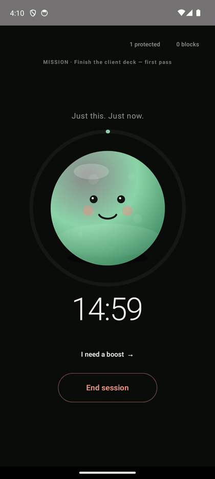
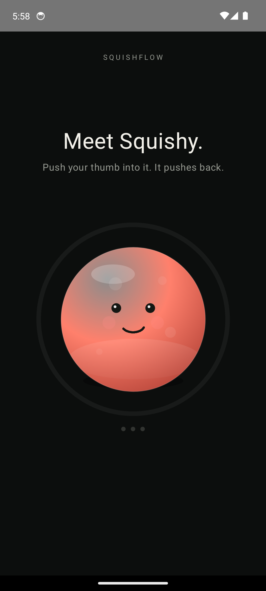
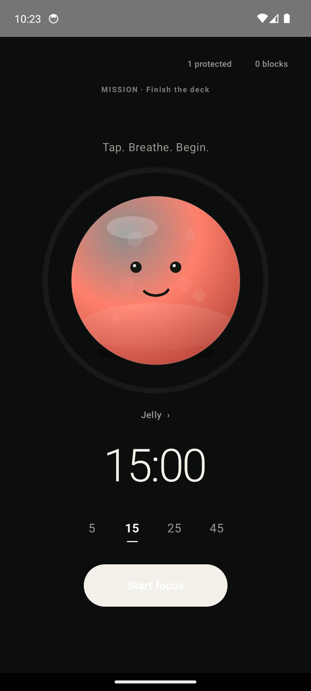
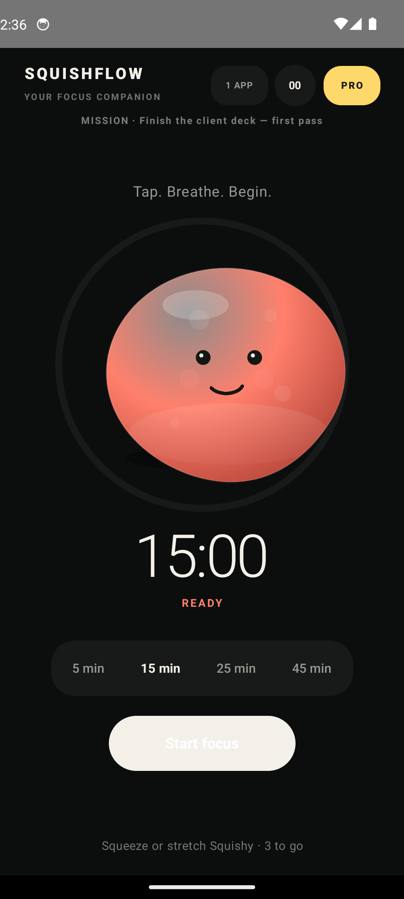
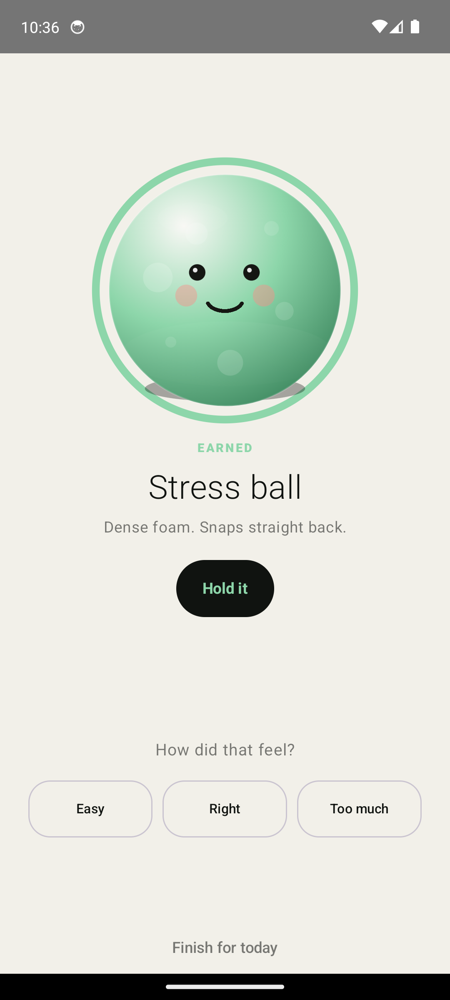
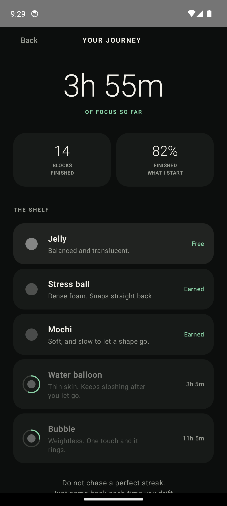
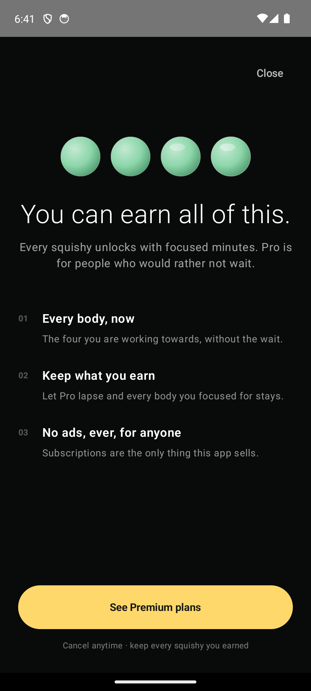
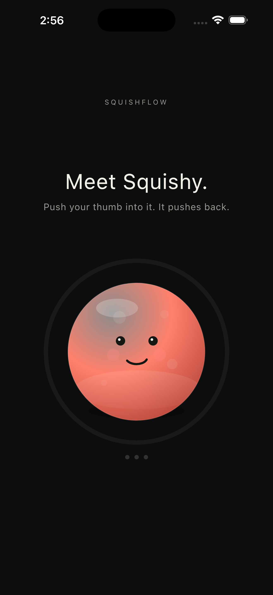
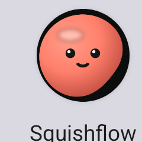

# Squishflow

**A focus timer you can squeeze.** One Kotlin codebase, one Compose UI, Android and iPhone.

[](https://github.com/tapaderuza/squishflow/actions/workflows/ios.yml)

Every focus app asks you to be disciplined at exactly the moment you have no discipline left. Squishflow puts a soft body between you and the work: you tell it what you want to finish, it hands back blocks short enough to believe, and while you sit with the tension you push your thumb into Squishy and it pushes back.

<p align="center">
  
</p>
<p align="center">
  
  
  
</p>

---

## The squishy is a physics model

`SquishyPhysics` is the part worth reading. The silhouette is a ring of 26 radial samples, each with a displacement and a velocity:

- **Neighbour coupling** — the discrete Laplacian around the ring — turns every press into a wave that travels across the surface instead of a local scale.
- **Volume conservation** removes the mean displacement on each step, so denting one side necessarily bulges the other. Without it the body just deflates under a held finger.
- **Fixed 240 Hz sub-stepping** means a dropped frame cannot push the explicit integrator past its stability limit.
- The frame loop **parks itself** once every sample is at rest, so an idle Squishy costs nothing.

The renderer passes a Catmull-Rom curve exactly through the simulated samples, so what the physics computes is what you see. It has no Compose dependency and is unit-tested, including the dropped-frame and held-finger cases that would otherwise only show up on a device as a body that explodes or resonates.

**It does the thing it asks of you.** Over a focus block the body softens and stops wobbling — stiffness falls, damping rises — and its breathing slows to match. The same drag gives about a fifth further at minute twenty-four than at minute one. Dropping stiffness alone would make it *wobblier* by the end, the opposite of the feeling, so a test asserts a settled body comes to rest faster than a fresh one.

### It has a face that does things nobody asked it to

A companion that only moves when touched is a control, not a character. Squishy opens its eyes when a screen appears rather than arriving with them open. It blinks on an irregular rhythm — a fixed interval reads as a metronome — and its gaze drifts a few pixels every few seconds, which is what makes eyes read as thinking rather than painted on. The eyes narrow with how hard you are pressing. Left alone for half a minute or so it stretches once and relaxes: the second mode of the ring, kept distinct from the three-lobed completion pulse so it reads as a sigh rather than as excitement. In the last minute of a block the breath it has been slowing for twenty minutes picks up again. Under reduced motion all of it stops, because none of it is movement you asked for.

### It has a voice, and no audio files

`SquishSynth` builds every squelch from noise through a resonant state-variable filter — cutoff sweeping *down* for compression and *up* for the rebound — over a low sine that gives the body its mass. Release loudness follows how deeply the finger was pressing. Generating rather than sampling means the sound cannot drift from the shape, and the waveform is bit-identical on Android and iOS because the noise is seeded.

Each material's voice is derived from its solver constants rather than authored: stiffness sets the pitch (as its square root, so twice as stiff is a fifth higher, not an octave), damping sets the length, coupling sets the wetness. A stress ball gets one dry burst; a water balloon squelches in four stages; a bubble rings for close to half a second on its tone. Tests pin the direction of each mapping, so making the foam stiffer makes it higher and nothing has to be retuned by hand.

Tests cannot tell you whether a synth sounds *good*, so they assert what fails silently: clipping, DC offset, filter runaway, clicks at the buffer edges. For the part only ears can judge, the unit tests write auditionable WAVs to `shared/build/audio-preview/`.

Haptics are part of the same object rather than decoration: Android drives the vibrator directly for per-accent amplitude, iOS uses the Taptic Engine and keeps its generators armed.

## Monetisation: focus is the currency

**Every squishy can be earned. Pro buys them now.**

| Material | Character | Unlocks at |
| --- | --- | --- |
| Jelly | Balanced and translucent | free |
| Stress ball | Dense foam, snaps straight back | 1 h of focus |
| Mochi | Soft, slow to let a shape go | 3 h |
| Water balloon | Thin skin, keeps sloshing | 7 h |
| Bubble | Weightless, the whole surface rings | 15 h |

This is deliberate rather than clever. A focus app that locks its rewards behind a card is working against the thing it claims to want: it profits when you pay, not when you concentrate. Making focused minutes the free currency means the app only becomes more rewarding the more it actually works. The subscription is a shortcut for people who would rather not wait — and the reason there are no ads and no analytics on anyone, paying or not.

Three consequences, all tested:

- **A lapsed subscription keeps everything you earned.** Taking back a body someone focused an hour for would punish them for using the app as intended.
- **A locked body shows how close you are**, not a padlock. The person is already on their way to it.
- **Earning one is a moment.** The block that crosses a threshold reveals the new body in its own finish, with its name and a button to start holding it. A block long enough to clear two rungs celebrates the better one.

Because only one body is free at the start, tapping a locked one hands it to you for six seconds before the upgrade screen appears. A list of names cannot communicate what dense foam feels like.

<p align="center">
  
  
  
</p>

### The materials are not reskins

Each one retunes the solver — stiffness, damping, neighbour coupling, stretch limit. A test asserts the difference is real: dense foam settles in fewer frames than jelly and a water balloon in more. If two materials ever came to rest at the same rate, the entitlement would be selling paint.

Hue deliberately stays out of it. Colour carries session state across the whole product — coral is tension, sage is focus, lavender is interruption — and a material that repainted the body would break the one signal the user has learned. Materials differ by finish: gloss, rim, speckle, translucency.

## One codebase, two platforms

<p align="center">
  
  
</p>

The UI, timer, planner, physics and audio synthesis are all in `commonMain`. The platform source sets hold only what genuinely differs — haptics, persistence, app selection — each behind the same `expect` declaration.

The project is developed on Windows and the only Mac available runs Monterey, which stops at Xcode 14 and cannot target a current iPhone. So the iOS build lives in CI: on every push a hosted Mac compiles the shared Kotlin for Apple, builds the Xcode project, boots a simulator, installs the app and photographs it. The shared Kotlin compiled for iOS on the first attempt. The badge above is the proof, not a claim.

## Design

**The first screen is the product.** No permission request, no list of apps. One body and nothing to read before you touch it. Protection setup waits behind the header until the app has earned the right to ask.

**Motion has a grammar.** Destinations carry a depth, and the transition between any two is chosen from what the move means: going deeper rises, going back falls, overlays travel their own axis, and an interruption arrives with no motion at all — being pulled out of a distraction should feel like a stop.

**The focus screen carries as little as it can.** No wordmark, no upgrade badge, no state word under the timer — hue already says it. The duration picker is type and a rule. The shelf lives one tap away on the journey screen, because choosing a toy is exactly the kind of small decision a focus block exists to protect you from.

**Finishing a block is the peak, so it is the reward.** A settled companion in the material you chose, the minutes banked, and a bar moving towards the next body.

**The copy is tested.** No exclamation marks, because enthusiasm raises the cost of starting. No failure or streak language, because an abandoned block is a thing that happened, not a verdict. Nothing longer than one line. The rules are assertions in `SquishyVoiceTest`.

**It has a position on streaks.** The app remembers the day it was last opened and nothing else about absence. Three or more days away and the idle line becomes *Been a while. Nothing to catch up on.* — the moment a streak app shows a broken chain is the moment this one says the gap does not count.

**The icon is the physics.** `tools/make_icon.py` carries a small port of the solver; the outline is the real soft-body silhouette at the peak of a held press, because a settled body is just a circle.

<p align="center">
  
</p>

## Accessibility

The system reduced-motion setting is honoured: the body still deforms under a finger — that is the interaction — but nothing moves that you did not move. Every body on the shelf carries a full screen-reader description including how much focus is left to earn it. The review screen scrolls and its steppers are labelled. Verified at 2.0× font scale.

## Honesty

The planner is **deterministic and on-device**. It does not learn, and there is no model behind it. The interface says "adaptive focus", never "AI". A remote provider must be reached through a backend; no API secret ever ships in a mobile binary.

## Build

```bash
./gradlew :shared:testDebugUnitTest :androidApp:assembleDebug
```

Android builds on Windows, macOS or Linux. Apple targets are declared only on macOS, so the project builds on the Windows machine it is developed on instead of failing inside the Kotlin/Native compiler. The iOS build itself runs in [GitHub Actions](.github/workflows/ios.yml).

Before any store submission: replace the RevenueCat test key with the platform keys, configure the offerings, sign the release builds, and run sandbox purchases on physical devices. `docs/PRODUCTION_READINESS.md` tracks that gate.

## Repository map

| Path | What lives there |
| --- | --- |
| `shared/src/commonMain/.../SquishyPhysics.kt` | The soft-body model. Pure Kotlin, no UI. |
| `shared/src/commonMain/.../SquishyCanvas.kt` | Gestures, the frame loop, the renderer. |
| `shared/src/commonMain/.../SquishyFace.kt` | Blinking, gaze drift, squint. |
| `shared/src/commonMain/.../SquishSynth.kt` | The synthesised voice. |
| `shared/src/commonMain/.../SquishyMaterial.kt` | The five bodies and their solver constants. |
| `shared/src/commonMain/.../MaterialAccess.kt` | Focus as currency: earned, purchased, locked. |
| `shared/src/commonMain/.../SquishyVoice.kt` | Every line the focus screen says. |
| `shared/src/commonMain/.../MissionPlanner.kt` | Goal decomposition. |
| `shared/src/commonMain/.../Navigation.kt` | The motion grammar. |
| `shared/src/commonMain/.../App.kt` | Screens and routing. |
| `shared/src/commonMain/.../Theme.kt` | Every colour in the product, named once. |
| `shared/src/commonTest/` | 109 tests: physics, materials, planner, voice, synth, access, persistence. |
| `tools/` | Icon generation, submission screenshots, the iOS walkthrough. |
| `submission/` | Devpost description, video shot list, icon and screenshots at the required sizes. |
| `docs/` | Product decisions, production gate, privacy draft. |

## Licence

Apache 2.0 — see [`LICENSE.txt`](LICENSE.txt).
