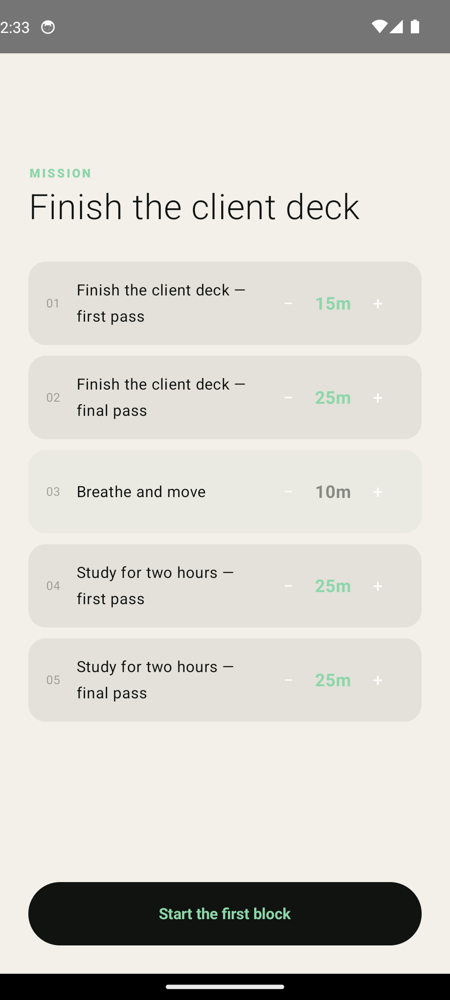
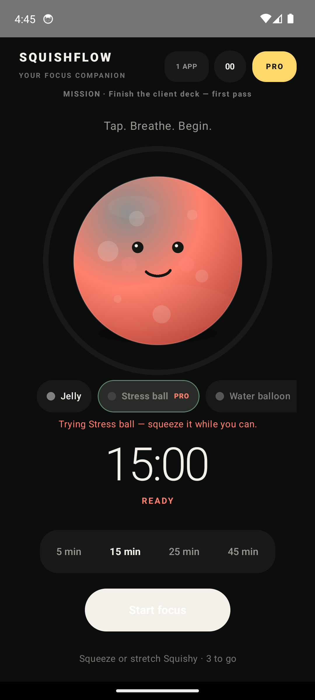

# Squishflow

**A focus timer you can squeeze.** Kotlin Multiplatform, one shared Compose UI, Android and iOS.

Rigid Pomodoro apps ask you to be disciplined at exactly the moment you have no discipline left. Squishflow puts a soft body between you and the work: you tell it what you want to finish, it hands back blocks short enough to believe, and while you sit with the tension you can push your thumb into Squishy and feel it push back.

<p align="center">
  
  
  
</p>
<p align="center">
  
  
</p>

---

## What is actually built

`Goal → mission plan → review → focus block → reflection → adapted next block`

- **Kotlin Multiplatform + Compose Multiplatform.** The UI, the timer, the planner and the physics are all in `commonMain`. The platform source sets hold only what genuinely differs: haptics, persistence, app selection, pose detection.
- **A soft-body Squishy.** Not a sprite being scaled — see below.
- **Monotonic timer** with `TENSE`, `RELAXING` and `COMPRESSED` states that drive colour, motion and face.
- **An offline planner** that decomposes a free-form goal into blocks, behind a `MissionPlanner` interface so a server-backed model can replace it without touching the UI.
- **Explainable adaptation.** One tap after each block: easy `+5m`, right `same`, too much `−5m`, clamped to 10–60.
- **RevenueCat KMP** paywall and the `squish_pro` entitlement boundary.
- **Conscious pause** on Android and Family Controls shielding on iOS, both optional and both behind an explicit disclosure.

## The squishy is a physics model

`SquishyPhysics` is the part worth reading. The silhouette is a ring of 26 radial samples, each with a displacement and a velocity:

- **Neighbour coupling** — the discrete Laplacian around the ring — turns every press into a wave that travels across the surface instead of a local scale.
- **Volume conservation** removes the mean displacement on each step, so denting one side necessarily bulges the other. Without it the body just deflates under a held finger.
- **Fixed 240 Hz sub-stepping** means a dropped frame cannot push the explicit integrator past its stability limit and blow the body up.
- The frame loop **parks itself** once every sample is at rest, so an idle Squishy costs nothing.

The renderer passes a Catmull-Rom curve exactly through the simulated samples, so what the physics computes is what you see. It has no Compose dependency and is covered by unit tests, including the dropped-frame and held-finger cases that would otherwise only show up on a real device as a body that explodes or resonates.

Haptics are treated as part of the same object rather than as decoration: Android drives the vibrator directly for per-accent amplitude, iOS uses the Taptic Engine and keeps its generators armed between hits.

### The voice is synthesised too

No audio files ship with the app. `SquishSynth` builds each squish from noise
through a resonant state-variable filter — cutoff sweeping *down* for compression
and *up* for the rebound — over a low sine that gives the body its mass. Loudness
on release follows how deeply the finger was actually pressing.

Generating rather than sampling means the sound cannot drift from the shape, and a
new material gets a voice by changing constants instead of commissioning a
recording. It is deterministic, so Android and iOS produce an identical waveform.

Tests cannot tell you whether a synth sounds *good*, so they assert the things
that go wrong silently: clipping, DC offset, filter runaway, clicks at the buffer
edges. For the part only ears can judge, running the unit tests writes auditionable
WAVs to `shared/build/audio-preview/`.

## Monetisation: focus is the currency

**Every squishy can be earned. Pro buys them now.**

| Material | Character | Unlocks at |
| --- | --- | --- |
| Jelly | Balanced and translucent | free |
| Stress ball | Dense foam, snaps straight back | 1 h of focus |
| Mochi | Soft, slow to let a shape go | 3 h |
| Water balloon | Thin skin, keeps sloshing | 7 h |
| Bubble | Weightless, the whole surface rings | 15 h |

This is deliberate rather than clever. A focus app that locks its rewards behind a
card is working against the thing it claims to want: it profits when you pay, not
when you concentrate. Making focused minutes the free currency means the app only
becomes more rewarding the more it actually works, and the subscription is a
shortcut for people who would rather not wait — plus the reason there are no ads
and no analytics on anyone, paying or not.

Two consequences fall out of it, and both are tested:

- **A lapsed subscription keeps everything you earned.** Taking back a body someone
  focused an hour for would punish them for using the app as intended.
- **A locked chip shows an arc of how close it is**, not a padlock, because the
  person is already on their way to it.

And because only one body is free at the start, tapping a locked chip hands you
that material for six seconds before the upgrade screen appears. A list of names
cannot communicate what dense foam feels like.

### The materials are not reskins

Each one retunes the solver — stiffness, damping, neighbour coupling, stretch
limit. A unit test asserts the difference is real: dense foam must settle in fewer
frames than jelly, and a water balloon in more. If two materials ever came to rest
at the same rate, the entitlement would be selling paint.

Hue deliberately stays out of it. Colour carries session state across the whole
product, and a material that repainted the body would break the one signal the
user has learned. Materials differ by finish: gloss, rim, speckle, translucency.

## Design

The focus screen is the one you spend real time on, so it carries as little as it
can. There is no wordmark — you know which app you are in — and no permanent
upgrade badge, because the upgrade path runs through the bodies you are working
towards. The state word under the timer is gone too: hue already carries state
everywhere else in the product, so spelling it out was saying the same thing
twice. The duration picker is type and a rule rather than a pill inside a track.

## Accessibility

The companion is built out of motion, so the system reduced-motion setting is
honoured rather than ignored: the body still deforms under a finger, because that
is the interaction and not decoration, but it stops breathing, ringing and pulsing
on its own. Every material chip carries a full TalkBack description including how
much focus is left to earn it, and the body announces its session state.

## Honesty about the planner

The current planner is **deterministic and on-device**. It does not learn, and there is no model behind it. The interface says "adaptive focus", never "AI", and the app tells you the plan was built on your device.

A remote provider must be reached through a backend. No API secret ever ships in a mobile binary.

## Build

Android, from Windows, macOS or Linux:

```bash
./gradlew :shared:testDebugUnitTest :androidApp:assembleDebug
```

iOS targets are declared only on macOS, so the project builds on a Windows machine instead of failing inside the Kotlin/Native compiler. On a Mac, open `iosApp/iosApp.xcodeproj` after running the same command.

Before any store submission: replace the RevenueCat test key with the platform keys, configure the offerings, sign the release builds, and run sandbox purchases on physical devices. `docs/PRODUCTION_READINESS.md` tracks that gate and is deliberately not all ticked.

## First run

The app used to open on a list of installed apps and an Accessibility permission
request. Someone evaluating it in thirty seconds would decide before ever
reaching the companion. The first screen is now the product — one body, nothing
to read before you touch it — and protection setup waits behind the header until
the app has earned the right to ask.

The launcher icon is generated by `tools/make_icon.py`, which carries a small
port of the physics: the outline is the real soft-body silhouette at the peak of
a held press, because a settled body is just a circle.

<p align="center">
  
</p>

## Repository map

| Path | What lives there |
| --- | --- |
| `shared/src/commonMain/.../SquishyPhysics.kt` | The soft-body model. Pure Kotlin, no UI. |
| `shared/src/commonMain/.../SquishyCanvas.kt` | Gestures, the frame loop and the renderer. |
| `shared/src/commonMain/.../SquishyMaterial.kt` | The five bodies and their solver constants. |
| `shared/src/commonMain/.../MissionPlanner.kt` | Goal decomposition. |
| `shared/src/commonMain/.../App.kt` | Screens and navigation. |
| `shared/src/commonMain/.../Theme.kt` | Palette and state colours. |
| `shared/src/commonTest/` | Physics, planner and timer tests. |
| `docs/` | Product decisions, production gate, privacy draft. |

## Licence

Apache 2.0 — see [`LICENSE.txt`](LICENSE.txt).
